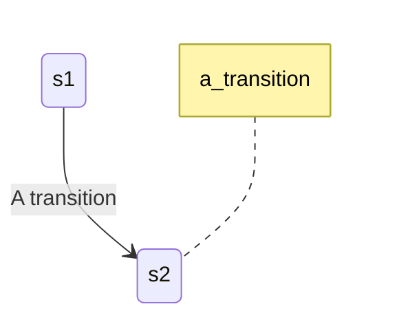
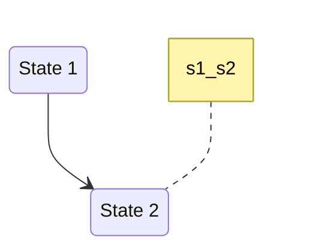

# Python parser for Mermaid State graphs

## Table of Contents

* [Description](#description)
* [Supported Features](#supported-features)
  * [States](#states)
  * [Transitions](#transitions)
  * [Start and End](#start-and-end)
* [Ignored Features](#ignored-features)
* [Unsupported Features](#unsupported-features)
* [Compatibility](#compatibility)
* [Dependencies](#dependencies)

## Description

The purpose of this parser is to provide the developer with the ability to parse [Mermaid State Diagrams](https://mermaid.js.org/syntax/stateDiagram.html) into Python dictionaries containing its states and transitions.

## Supported Features

The supported features are the following based on how they are listed on the [docs](https://mermaid.js.org/syntax/stateDiagram.html).

#### [States](https://mermaid.js.org/syntax/stateDiagram.html#states)

The States are functions, named after their *stateId* and saved on a Python dictionary.

#### [Transitions](https://mermaid.js.org/syntax/stateDiagram.html#transitions)

The Transitions are objects saved on a Python dictionary. The dictionary *key*, is generated by converting the transition description into a *snake-case* string...

e.g. 

or if there is no description available by the combination of the source stateID and the target stateID...

#### [Start and End](https://mermaid.js.org/syntax/stateDiagram.html#start-and-end)

The same functionality as States but for the default *_start_* and *_end_* functions which are unique and cannot get passed as stateIDs.

## Ignored Features

The following features are ignored by the parser whether they are included into a script or not. Presented, again, as stated in the [docs](https://mermaid.js.org/syntax/stateDiagram.html).

* [Title header](https://mermaid.js.org/syntax/stateDiagram.html)

* [Notes](https://mermaid.js.org/syntax/stateDiagram.html#notes)

* [Setting the direction of the diagram](https://mermaid.js.org/syntax/stateDiagram.html#setting-the-direction-of-the-diagram)

* [Comments](https://mermaid.js.org/syntax/stateDiagram.html#comments)

* [Styling with classDefs](https://mermaid.js.org/syntax/stateDiagram.html#styling-with-classdefs)

### Unsupported Features

The following features are **not yet** supported by the parser. Presented, again, as stated in the [docs](https://mermaid.js.org/syntax/stateDiagram.html). The appropriate errors are thrown when anything related to these is detected from the parsing sequence.

* [Composite states](https://mermaid.js.org/syntax/stateDiagram.html#composite-states)

* [Choice](https://mermaid.js.org/syntax/stateDiagram.html#choice)

* [Forks](https://mermaid.js.org/syntax/stateDiagram.html#forks)

## Compatibility

This parser is compatible with any version equal or greater than [IronPython 3.4.1](https://ironpython.net/) and its Python equivalent which is Python 3.4.

*__Note__: IronPython3.4.1 support some Python 3.6 features which are listed in its website and [repository](https://github.com/IronLanguages/ironpython3).*

## Dependencies

* IronPython dependencies 
  
  * [IronPython 3.4.1 site](https://ironpython.net/)
  * [IronPython 3.4.1 repository](https://github.com/IronLanguages/ironpython3)

* [Mermaid JS 10.5.0](https://mermaid.js.org/syntax/stateDiagram.html)
